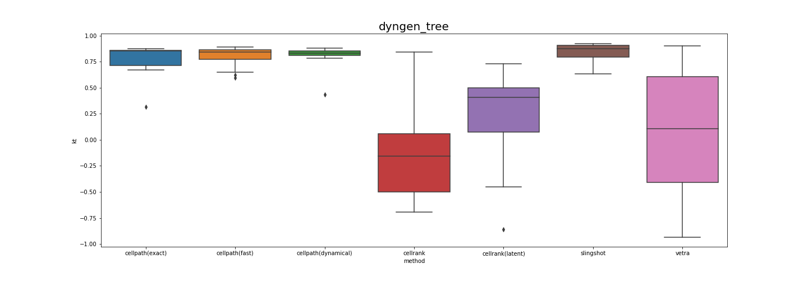
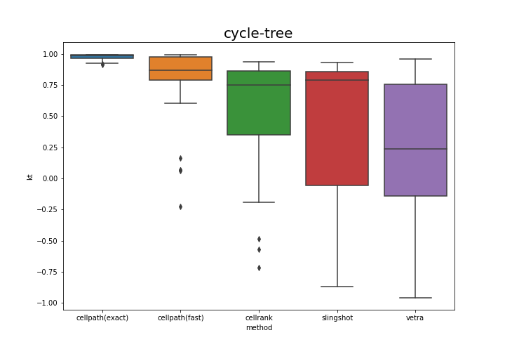
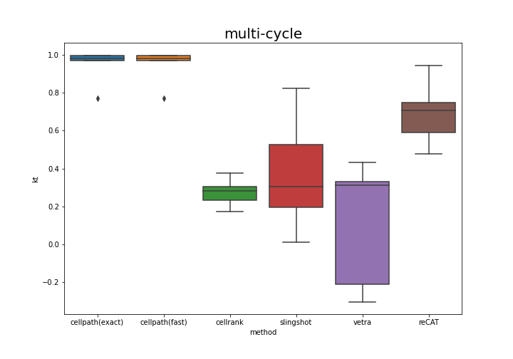

# Notes

### Vetra

Vetra uses the gene expression and RNA-velocity projection on two dimensional space to construct the graph, find weakly connected components that correspond to trajectory structure, and assign cell pseudotime using principal curve.

* Nonlinear two dimension space remove a huge amount of noise, and detort the original data structure, the information loss is more severe than using meta-cell. 
* Nonlinear visualization like umap and tsne does not guarantee to preserve the continuity of original trajectory, if cell population density is changed, then it will break the trajectory apart. Cannot depends on such visualization to do trajectory inference.
* It is still an open problem how to project RNA velocity onto nonlinear space, currently uses transition probability to do so, just for visualization, not actually RNA velocity anymore.
* principal curve in the final step doesn't fully utilize RNA velocity information, still transcriptome similarity. May not work well in complex structure.

**Vetra pipeline**

* Run RNA velocity inference.
* Calculate the velocity and gene expression embedding on nonlinear space.
* Use the embeddings to infer the trajectories and pseudotime.

### CellRank

CellRank uses RNA velocity to calculate the transition matrix of the cell differentiation process, and estimate initial and terminal states and probabilistic fate maps. CellRank, in principle, does not infer trajectory and pseudotime, but the initial and terminal states, and the fate map itself still can be used for trajectory inference.

**CellRank pipeline**

* Run RNA velocity inference, `scvelo` either `dynamical` or `stochastic` model.
* Infer the `initial state` and `terminating state` using CellRank.
* Infer the `lineage probability` using CellRank.
* Infer the pseudotime using `latent time/diffusion pseudotime`,
  * the cellrank tutorial uses latent time, vetra uses diffusion pseudotime. 
  * VeloSim simulation does not work well in dynamical mode (latent time), Dyngen simulation does not work well in stochastic mode (diffusion pseudotime).
* Thresholding the lineage probability to assign cell into different lineages.
* Calculating Kendall-tau score for each lineages.

### Test on dyngen-tree

Simulated totally 4 binary trees using the default parameters in the [example](https://dyngen.dynverse.org/articles/showcase_backbones.html), change the number of cells and random seeds. (Only when the seed equals to $6$ the total 4 branches can be generated, always missing some branch.)

Run: 

* CellPath (using stochastic/dynamical version of RNA velocity, number of trajectories being set to $6$)

* Vetra (using stochastic version of RNA velocity)
* CellRank (using stochastic/dynamical version of RNA velocity)
* Slingshot (using ground truth root cell)

Calculating the Kendall tau score for each inferred trajectory separately.

Vetra perform the worst, it uses the nonlinear projection to do inferences, sometimes trajectory broke down in the nonlinear visualization, and vetra will make it into one branch.

### Test on cycle-tree

### Test on multi-cycles

Greedy algorithm is actually optimal. Greedy stays ahead. Remove redundant edges. 

Pool of paths, any two cells that are connected.

According to the belongings, hard to merge. 

